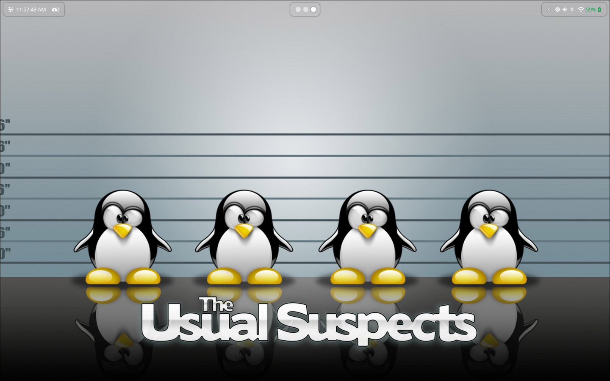
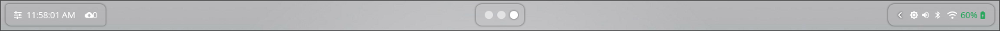
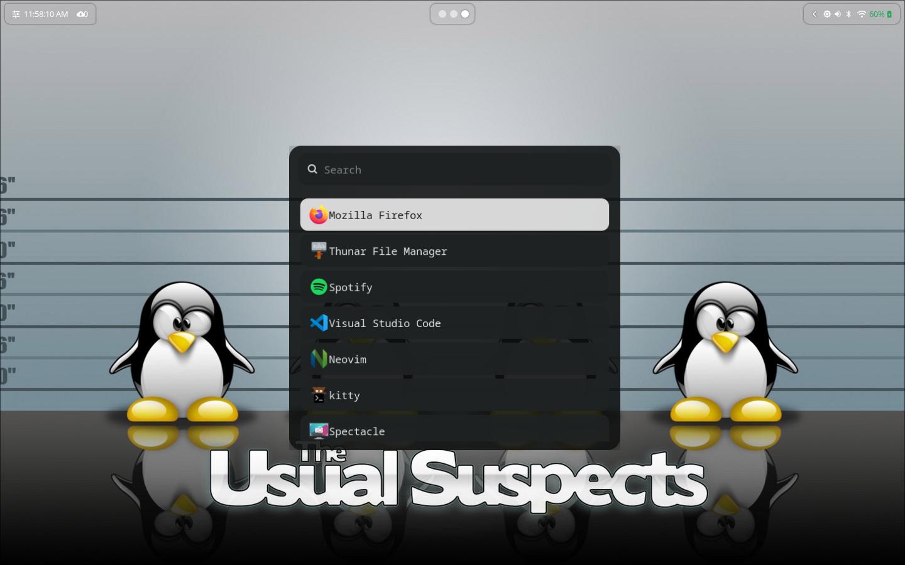
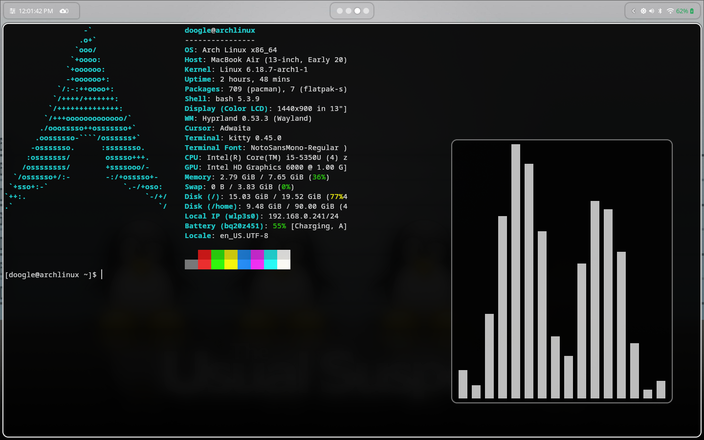

# Arch Linux + Hyprland Dotfiles

My personal Arch Linux setup using **Hyprland** with a minimal, Wayland-first workflow.

## Included
- Hyprland configuration
- Waybar (with scripts)
- Kitty terminal
- SwayNC notifications
- Wofi launcher
- Custom scripts
- Fonts
- Wallpapers
- Package lists (pacman + AUR)

## To Do List
- SwayNC notifications customization

## Structure
```text
dotfiles/
├── config/
│   ├── hypr/
│   │   └── hyprland.conf
│   ├── kitty/
│   ├── waybar/
│   │   ├── config/
│   │   ├── themes/
│   │   ├── scripts/
│   │   └── assets/
│   ├── wofi/
│   └── swaync/
├── scripts/
│   └── wallpaper-next.sh
├── wallpapers/
│   ├── archbtw.png
│   ├── tuxblack.png
│   └── linuxvwindows.jpg
├── screenshots/
│   ├── desktop.png
│   ├── waybar.png
│   └── wofi.png
├── pkglist/
│   ├── pkglist-pacman.txt
│   └── pkglist-aur.txt
└── README.md
```

## Notes
- Monitor configuration may need adjustment per system
- Designed for Arch Linux + Wayland
- Hardware: MacBook Air 2017 (Intel)

<details>
<summary><b>Keybinds (click to expand)</b></summary>

<br>

**Modifier key:** `Super` (⌘ / Windows key)

### Applications
| Keybind | Action |
|-------|-------|
| Super + Space | Open terminal (kitty) |
| Super + R | Application launcher (wofi) |
| Super + E | File manager (Thunar) |
| Super + W | Cycle wallpaper |
| Super + S | Screenshot (select area) |
| Super + Shift + S | Screenshot (entire screen) |
| Super + Ctrl + S | Screenshot to clipboard |

---

### Window Management
| Keybind | Action |
|-------|-------|
| Super + Q | Close focused window |
| Super + F | Toggle fullscreen |
| Super + V | Toggle floating window |
| Super + P | Toggle pseudo-tiling (dwindle) |
| Super + J | Toggle split orientation (dwindle) |

---

### Focus Movement
| Keybind | Action |
|-------|-------|
| Super + ← | Focus window left |
| Super + → | Focus window right |
| Super + ↑ | Focus window up |
| Super + ↓ | Focus window down |

---

### Move Windows
| Keybind | Action |
|-------|-------|
| Super + Shift + ← | Move window left |
| Super + Shift + → | Move window right |
| Super + Shift + ↑ | Move window up |
| Super + Shift + ↓ | Move window down |

---

### Workspaces
| Keybind | Action |
|-------|-------|
| Super + 1–9 | Switch to workspace 1–9 |
| Super + 0 | Switch to workspace 10 |
| Super + Shift + 1–9 | Move window to workspace 1–9 |
| Super + Shift + 0 | Move window to workspace 10 |

---

### Mouse
| Keybind | Action |
|-------|-------|
| Super + Left Click | Move window |
| Super + Right Click | Resize window |

---

### System Controls
| Keybind | Action |
|-------|-------|
| XF86AudioRaiseVolume | Volume up |
| XF86AudioLowerVolume | Volume down |
| XF86AudioMute | Toggle mute |
| XF86MonBrightnessUp | Brightness up |
| XF86MonBrightnessDown | Brightness down |

---

### Gestures
- **3-finger horizontal swipe** — switch workspaces

</details>

## Screenshots




